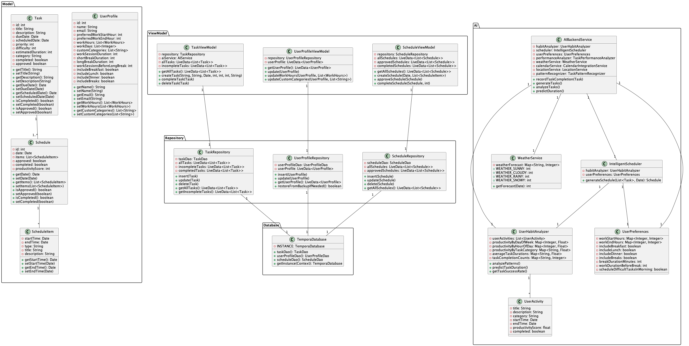

# Documentation UML de l'Application Tempora

## Table des matières
1. [Diagramme de Cas d'Utilisation](#1-diagramme-de-cas-dutilisation)
2. [Diagramme de Classes](#2-diagramme-de-classes)
3. [Diagramme de Séquence](#3-diagramme-de-séquence)
4. [Diagramme d'Activités](#4-diagramme-dactivités)
5. [Diagramme d'États](#5-diagramme-détats)
6. [Diagramme de Composants](#6-diagramme-de-composants)
7. [Diagramme de Déploiement](#7-diagramme-de-déploiement)

## 1. Diagramme de Cas d'Utilisation

Ce diagramme montre les interactions entre les acteurs (utilisateurs et système IA) et les fonctionnalités du système.

### Acteurs principaux :
- **Utilisateur** : Interagit directement avec l'application
- **Système IA** : Gère les tâches automatisées et l'intelligence artificielle

### Cas d'utilisation principaux :
- Gestion des tâches
- Consultation du planning
- Personnalisation des préférences
- Analyse des statistiques
- Génération de suggestions
- Approbation des tâches IA

## 2. Diagramme de Classes

Ce diagramme représente la structure statique de l'application.

### Packages principaux :
- **Model** : Contient les classes de données
- **AI** : Contient les classes d'intelligence artificielle
- **Service** : Contient les services de l'application

### Classes clés :
- `Task` : Représente une tâche
- `AIBackendService` : Gère la logique d'IA
- `UserHabitAnalyzer` : Analyse les habitudes utilisateur

## 3. Diagramme de Séquence

Ce diagramme montre les interactions entre les composants lors de la génération d'un planning.

### Flux principal :
1. L'utilisateur demande un planning
2. Le système analyse les habitudes
3. Vérifie les conditions externes (météo, calendrier)
4. Génère des suggestions
5. Présente le planning à l'utilisateur

## 4. Diagramme d'Activités

Ce diagramme montre le flux de travail de la génération de planning.

### Étapes principales :
1. Analyse des habitudes utilisateur
2. Vérifications parallèles (météo, calendrier, localisation)
3. Génération des suggestions
4. Gestion des conflits
5. Validation utilisateur

## 5. Diagramme d'États

Ce diagramme montre les différents états d'une tâche dans le système.

### États principaux :
- Non Planifiée
- En Attente
- Suggérée
- Approuvée
- En Cours
- Complétée
- Reportée

## 6. Diagramme de Composants

Ce diagramme montre l'architecture technique de l'application.

### Couches principales :
- **UI Layer** : Interface utilisateur
- **Business Layer** : Logique métier
- **AI Layer** : Intelligence artificielle
- **External Services** : Services externes

## 7. Diagramme de Déploiement

Ce diagramme montre l'architecture physique du système.

### Composants principaux :
- **Appareil Android** : Application mobile
- **Services Externes** : 
  - Service Météo
  - Service Calendrier
  - Service Localisation
- **Base de données locale** : SQLite

## Utilisation de cette documentation

Cette documentation UML peut être utilisée pour :

1. **Cahier des charges** :
   - Comprendre les fonctionnalités du système
   - Identifier les acteurs et leurs interactions
   - Définir les exigences techniques

2. **Développement** :
   - Guide pour l'implémentation
   - Référence pour la structure du code
   - Base pour les tests unitaires

3. **Maintenance** :
   - Comprendre l'architecture du système
   - Faciliter les modifications futures
   - Former les nouveaux développeurs

4. **Documentation technique** :
   - Support pour la documentation API
   - Guide d'intégration
   - Manuel de déploiement
