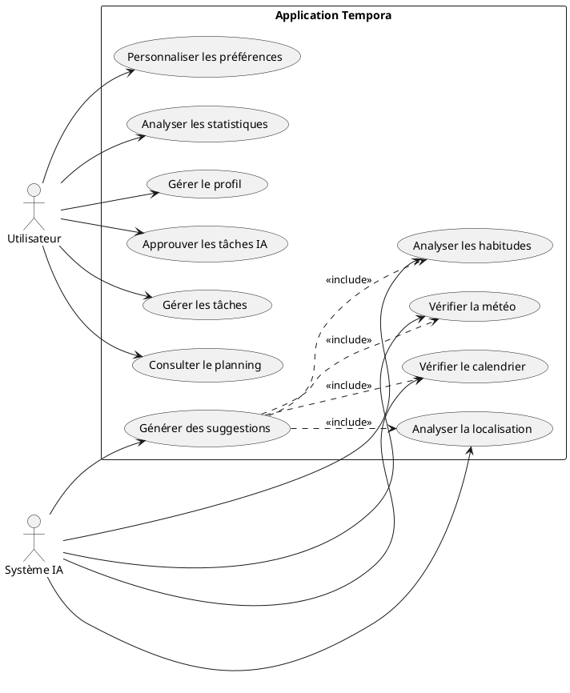
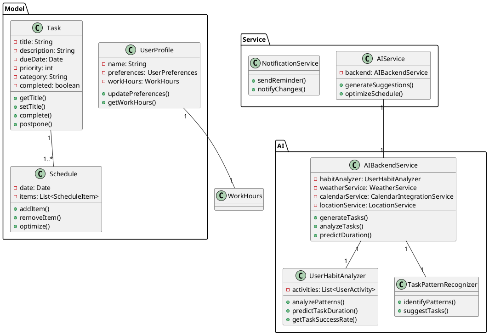
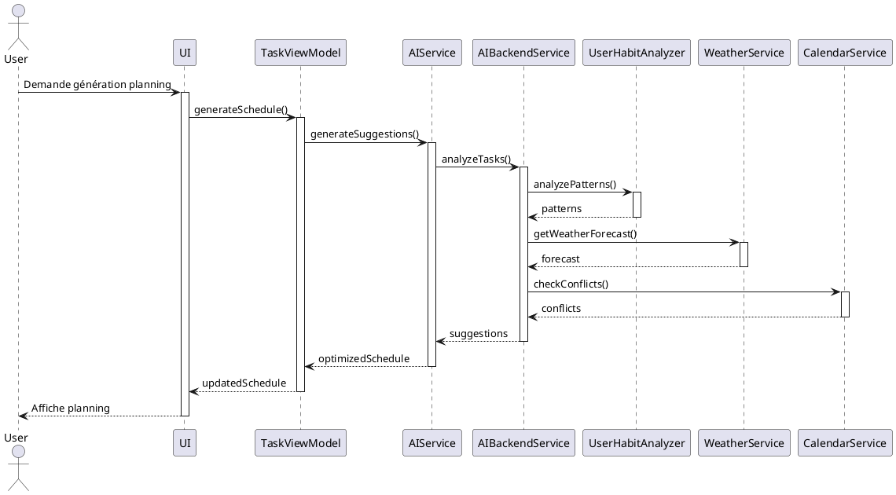
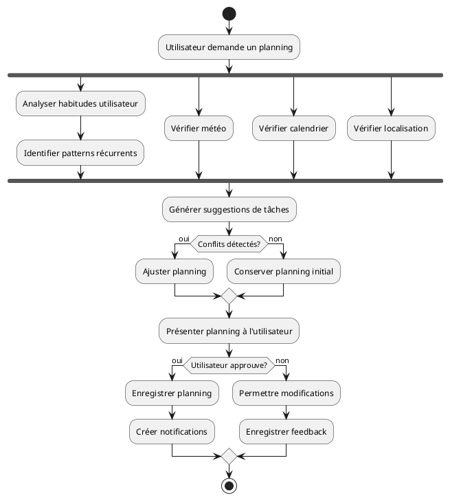
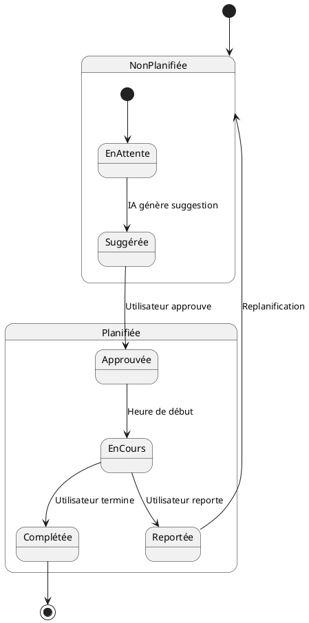
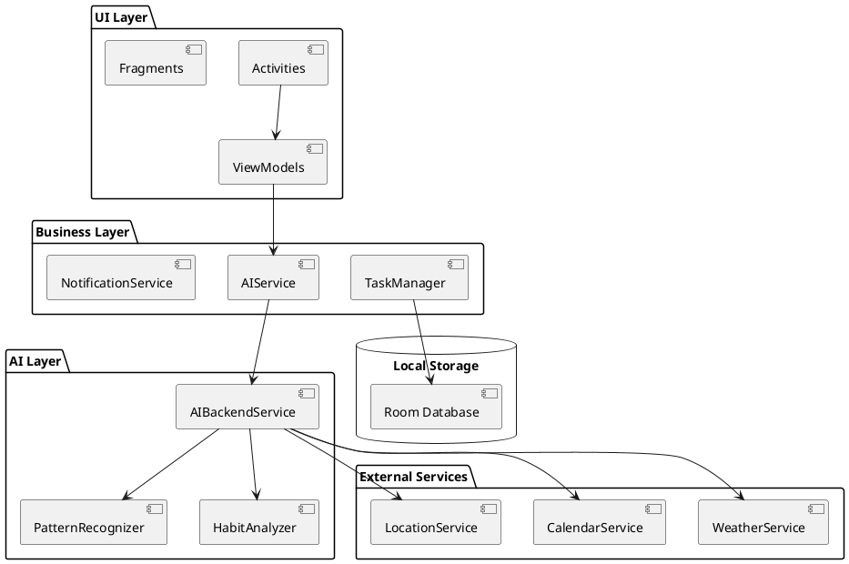
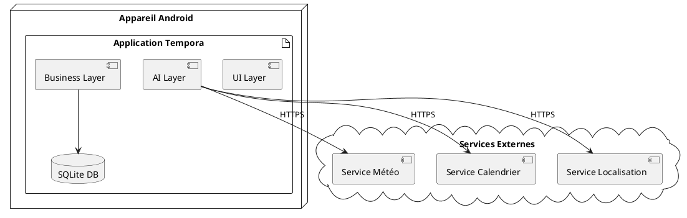

# Documentation UML de l'Application Tempora

## 1. Diagramme de Cas d'Utilisation

## 2. Diagramme de Classes

## 3. Diagramme de Séquence

## 4. Diagramme d'Activités

## 5. Diagramme d'États

## 6. Diagramme de Composants

## 7. Diagramme de Déploiement

## Légende et Notes

### Conventions de couleurs
- Bleu : Composants système
- Vert : Actions utilisateur
- Rouge : Points critiques/erreurs
- Jaune : Processus d'IA

### Notes importantes
1. Les diagrammes sont basés sur l'implémentation actuelle de l'application
2. Les relations et dépendances reflètent l'architecture MVVM
3. L'accent est mis sur l'intégration des composants d'IA
4. Les services externes sont représentés de manière simplifiée
